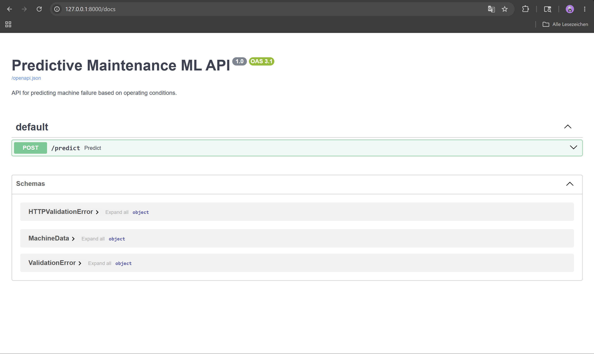
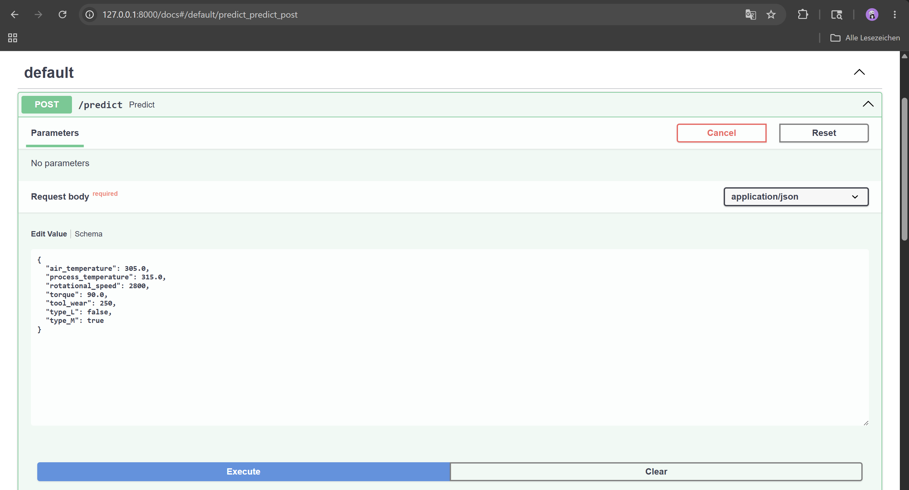
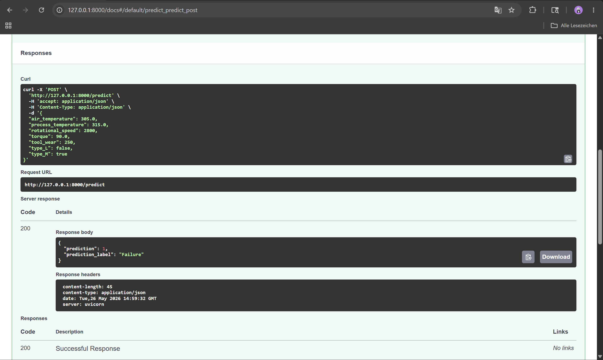

# Predictive Maintenance ML API

Machine Learning project for predictive maintenance using Logistic Regression and Random Forest.

## Features

- Predict machine failures using machine learning
- FastAPI prediction endpoint
- Random Forest classification model
- Classification metrics and confusion matrix
- Interactive API documentation with Swagger UI

---

## Tech Stack

- Python
- Pandas
- Scikit-learn
- FastAPI
- Uvicorn
- Joblib

---

## Project Overview

This project predicts machine failures based on operating conditions and machine data.

The workflow includes:
- Data preprocessing with Pandas
- Feature encoding
- Machine learning with Scikit-learn
- Model evaluation using classification metrics
- Deployment with FastAPI

The final deployed model uses a Random Forest Classifier.

---

## Machine Learning Workflow

1. Load and analyze the dataset
2. Clean and preprocess the data
3. Encode categorical features
4. Split data into training and test sets
5. Train machine learning models
6. Evaluate model performance
7. Save the trained model
8. Deploy prediction API with FastAPI

---

## Model Performance

### Logistic Regression
- Accuracy: 97.4%
- Recall (Failure Detection): 30%

### Random Forest
- Accuracy: 98.45%
- Recall (Failure Detection): 57%

Random Forest achieved significantly better failure detection performance.

---

## API Usage

Start the API:

```bash
uvicorn api.main:app --reload
```

Open Swagger UI:

```text
http://127.0.0.1:8000/docs
```

---

## API Endpoint

### POST /predict

Example Request:

```json
{
  "air_temperature": 305.0,
  "process_temperature": 315.0,
  "rotational_speed": 2800,
  "torque": 90.0,
  "tool_wear": 250,
  "type_L": false,
  "type_M": true
}
```

Example Response:

```json
{
  "prediction": 1,
  "prediction_label": "Failure"
}
```

---

## Screenshots

### FastAPI Documentation



### Prediction Input



### Prediction Response



---

## Project Structure

```text
predictive-maintenance-ml-api/
├── api/
│   └── main.py
├── data/
│   └── predictive_maintenance.csv
├── models/
│   └── random_forest_model.pkl
├── notebooks/
│   └── analysis.ipynb
├── screenshots/
├── src/
│   └── train_model.py
├── .gitignore
├── README.md
└── requirements.txt
```

---

## Run Locally

Install dependencies:

```bash
pip install -r requirements.txt
```

Run the API:

```bash
uvicorn api.main:app --reload
```

Open in browser:

```text
http://127.0.0.1:8000/docs
```